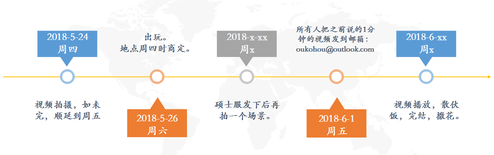

## 旭哥和我的构想
粗略的一点想法，有待大家群策群力，继续改进。

### 大纲：

1. 是要拍奔散各地 + 在电子科大的的视频，每个人都要有；
2. 主题是“人散心不散”，同时每个人也最好能有自己的个性化的部分；
3. 每个人拍一下自己的独立部分的视频，时长1分钟，（当然，班对的话可以一起拍）内容为：
   >对十年后的自己的想法；

   >对班级的看法；

   >在视频里埋下伏笔，自己的去向，工作状态，人生想法之类的。十年之后，我们来看看谁的想法实现了，而谁的想法又发生了变化。

   >最好在自己所在地的标志性景物拍摄，多样化嘛。

### 故事线：
然后就是这个视频的拍摄了。如何用一个故事一样的东西来串联起来，不像流水线一样的东西呢？

我的构思是：

    拍摄几个场景，串起来形成一个大学生活的剪影，最后闪回，梦幻泡影，发现还在开学的时候。

#### 场景：
 - 上课

    一群人在上某一节课，有人睡着，有人认真，有人聊天，有人游戏。

    然后下课，相互呼喊，一起去玩游戏。

    课程选择：随机选择还是找瑞姐/韩姐/~~欧总~~客串？

  - 游戏

    撕名牌。需要购买名牌贴。体力原因，为保护女生，名牌不是简单的撕，规则为:

    阵营战 + 个人战。

    个人：金、木、土、水、火。五行相克: 金克木, 木克土, 土克水, 水克火, 火克金。
    每个人属一个属性，对应可撕相克属性，无相克关系属性可暴力撕。

    阵营：青、黄、黑、白、赤。阵营无相克关系。

    阵营胜利有奖，个人人头最多者有奖。

    有技能卡存在，具体获取方式为：成就达成即可获取对应技能卡，每种技能卡只有一张，先到先得。

    成就为：隐藏，成就的获得偏向于做好事、表现好、正能量。
  -  宿舍

    各宿舍生活，打游戏，看剧，etc.早起时拍，晚上睡觉时拍。
    具体细节面议。
   - 群体聚餐

    just do it.
   - 出玩

    阆中？or...where？
   - 闪回

   还在上课，一场梦而。

   而浮生若梦，为欢几何？

#### ps
为呼应本科毕业时一群人在主楼楼梯上的视频，重拍该场景，每人对7年后的自己说句话。

当然，人数已不足，但也是个象征。

以上。
~~有待大家群策群力，继续改进。~~

~~大家正好趁五一的时候选景拍摄一分钟的那个视频，完美。~~

提交一分钟视频的时间点：2018-6-01，周五。

总体时间安排：

大家周知。

